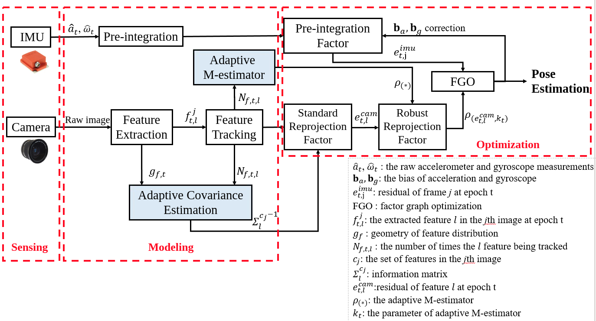
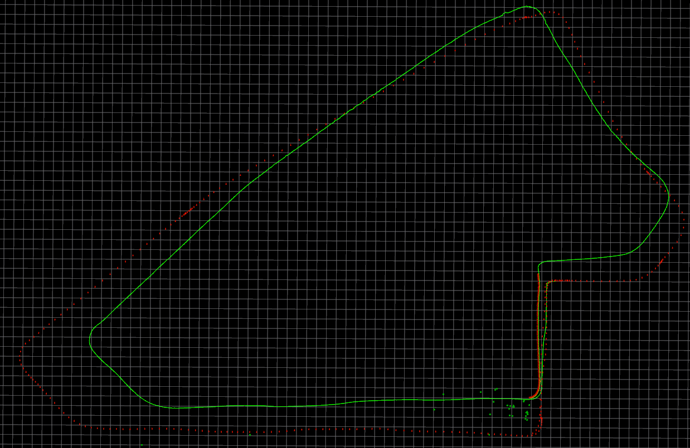

# Robust Visual-Inertial Integrated Navigation System Aided by Online Sensor Model Adaption for Autonomous Ground Vehicles in Urban Areas 

## Abstract
Visual-inertial integrated navigation system (VINS) has been extensively studied over the past decades to provide accurate and low-cost positioning solutions for autonomous systems. Satisfactory performance can be obtained in an ideal scenario with sufficient and static environment features. However, there are usually numerous dynamic objects in deep urban areas, and these moving objects can severely distort the feature tracking process which is fatal to the feature-based VINS. The well-known method mitigates the effects of dynamic objects is to detect the vehicles using deep neural networks and remove the features belongs to the surrounding vehicle. However, excessive exclusion of features can severely distort the geometry of feature distribution, leading to limited visual measurements. Instead of directly eliminating the features from dynamic objects, this paper proposes to adopt the visual measurement model based on the quality of feature tracking to improve the performance of VINS. Firstly, a self-tuning covariance estimation approach is proposed to model the uncertainty of each feature measurements by integrating two parts: 1) the geometry of feature distribution (GFD), 2) the quality of feature tracking. Secondly, an adaptive M-estimator is proposed to correct the measurement residual model to further mitigate the impacts of outlier measurements, such as the dynamic features. Different from the conventional M-estimator, the proposed method effectively alleviate the reliance of excessive parameterization of M-estimator. Experiments are conducted in a typical urban area of Hong Kong with numerous dynamic objects, and the results show that the proposed method could effectively mitigate the effects of dynamic objects and improved accuracy of VINS is obtained when compared with the conventional method. 

Keywords: Visual-inertial integrated navigation system (VINS); Visual odometry; Autonomous driving; Adaptive covariance; Adaptive M-estimator; Urban area; Feature tracking 

<p align="center">
  
</p>

## Day 20200104:
- Trajectory
<p align="center">
  
</p>

- parameters used 

| Parameters | Values |
| :---:  | :---:  |
| loss function | new ceres::HuberLoss(1.0); |
| cov of visual measurements | fixed |


## Introduction
This is a package for Remote Sensing Journal. The major contributions of this paper are listed as showed in the abstract: 

## Build 
```bash
cd ~/catkin_ws/src
git clone https://github.com/weisongwen/Adaptive_VINS
cd ../
catkin_make
source ~/catkin_ws/devel/setup.bash
cd src/
./all_graph_mapping.sh
```

# Credites
This baseline framework is heavily derived from [VINS-Fusion](https://github.com/HKUST-Aerial-Robotics/VINS-Fusion). If there is any thing inappropriate, please contact me through 17902061r@connect.polyu.hk (Weisong WEN).

## Publication

1. Wen, Weisong, Guohao Zhang, and Li-Ta Hsu. "Exclusion of GNSS NLOS receptions caused by dynamic objects in heavy traffic urban scenarios using real-time 3D point cloud: An approach without 3D maps." Position, Location and Navigation Symposium (PLANS), 2018 IEEE/ION. IEEE, 2018. (https://ieeexplore.ieee.org/abstract/document/8373377/)# remoteSensing2020
